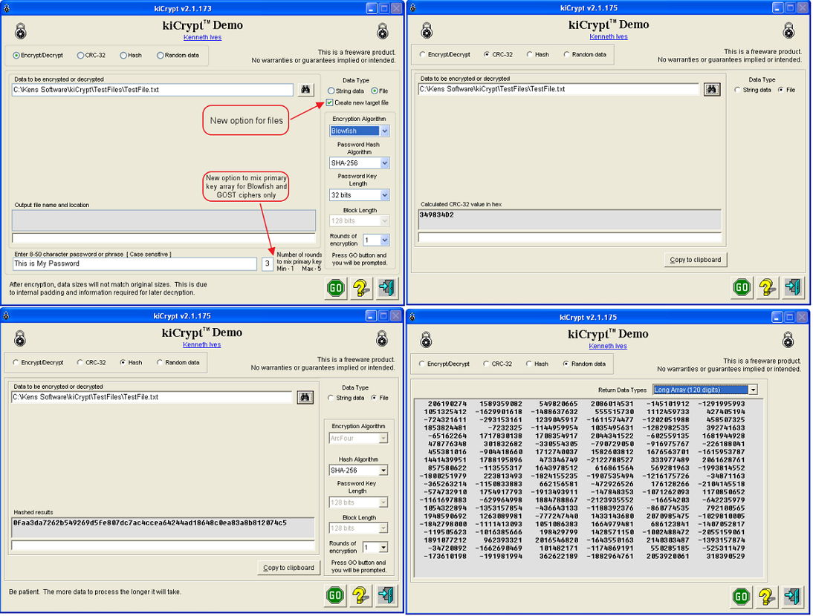



## kiCrypt Demo 15\-Jun\-2012

### Description

Various cipher and hash algorithms. Ciphers include ArcFour, Base64, Blowfish, Gost, Rijndael, Serpent, Skipjack, Twofish. Hashes include MD2, MD4, MD5, SHA1, SHA2 family, Tiger3-128-512, Whirlpool-224-512. Also CRC32 and random number demos.

=== 08-Mar-2012 Updated cipher modules for speed. Updated documentation to reference FIPS 180-4 dated Mar-2012.

=== 15-Jun-2012 Updated support modules.
 
### More Info
 

             |
---                |---
**Submitted On**   |2012-06-14 18:38:34
**By**             |[Kenaso](https://github.com/Planet-Source-Code/PSCIndex/blob/master/ByAuthor/kenaso.md)
**Level**          |Intermediate
**User Rating**    |4.8 (48 globes from 10 users)
**Compatibility**  |VB 6\.0
**Category**       |[Encryption](https://github.com/Planet-Source-Code/PSCIndex/blob/master/ByCategory/encryption__1-48.md)
**World**          |[Visual Basic](https://github.com/Planet-Source-Code/PSCIndex/blob/master/ByWorld/visual-basic.md)
**Archive File**   |[kiCrypt\_De2224926142012\.zip](https://github.com/Planet-Source-Code/kenaso-kicrypt-demo-15-jun-2012__1-73481/archive/master.zip)

